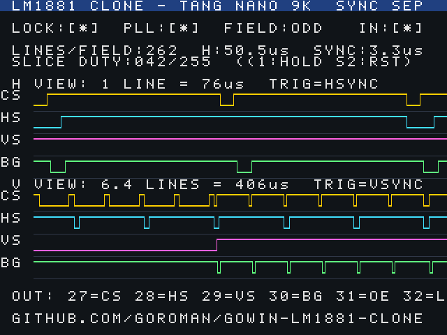

# gowin-lm1881-clone

GOWIN FPGA (Tang Nano 9K / GW1NR-9C, HDMI 付き) で **LM1881 相当のビデオ同期分離 (Video Sync Separator)** を作るプロジェクト。

コンポジットビデオ (NTSC / PAL) から以下を取り出します。LM1881 と同じピン機能を Verilog で再現しています。

| 出力 | LM1881 ピン | 内容 |
|---|---|---|
| `csync_n`    | pin 1 COMPOSITE SYNC OUT | 複合同期 (負論理、入力をクリーンアップしたもの) |
| `vsync_n`    | pin 3 VERTICAL SYNC OUT  | 垂直同期 (負論理、垂直同期期間中 L) |
| `burst_n`    | pin 5 BURST/BACK PORCH   | バーストゲート (負論理、H同期後縁から 0.6us 遅れて 2.5us) |
| `odd_even`   | pin 7 ODD/EVEN           | フィールド判別 (奇数フィールド H) |
| `hsync_n`    | (LM1881 には無し)        | 水平同期 (負論理、等化パルス除去済み・固定幅) |
| `locked`     | (LM1881 には無し)        | 同期検出中フラグ |

追加で、HDMI 出力にステータス (同期波形のオシロ風表示・フィールド判定・ライン数) を表示します。

## ハードウェア

- ボード: **Sipeed Tang Nano 9K** (GW1NR-LV9QN88PC6/I5, 27 MHz 水晶, HDMI コネクタ)
- ビデオ入力フロントエンド: コンポジット信号を比較器で 2 値化して FPGA に入れる (後述)

## 作業 STEP

各 STEP ごとに 1 コミットしています。`git log` と対応します。

- [x] **STEP 0**: リポジトリ作成 (public)、README に計画を書く
- [x] **STEP 1**: コア RTL `rtl/sync_separator.v` と NTSC 模擬テストベンチ `sim/tb_sync_separator.v` (iverilog で検証)
- [x] **STEP 2**: Tang Nano 9K 用トップ `rtl/top_tang_nano_9k.v`、ピン制約 `constr/tang_nano_9k.cst`、スライスレベル用 PWM DAC (gw_sh で合成・配置配線 OK)
- [x] **STEP 3**: HDMI ステータス表示 (640x480@60, TMDS エンコーダ, 同期波形表示)
- [x] **STEP 4**: GOWIN EDA (`gw_sh`) で合成 → ビットストリーム生成 → `openFPGALoader` で書き込み、Makefile / CI 整備

## STEP 1: コア RTL の設計

`rtl/sync_separator.v` はすべて **パルス幅と間隔の時間計測** で動く純デジタル回路です (ADC 不要、比較器で 2 値化した同期信号だけを使う)。

```
video_in ─▶ 2段FF同期化 ─▶ グリッチフィルタ(0.3us) ─▶ csync_n
                                   │
                                   ├─▶ L幅計測 ──▶ 分類: EQ(<3.5us) / H(<7us) / BROAD(<40us)
                                   │                      │
                                   │                      ├─▶ 最初のBROADで vsync_n=L、非BROADで H
                                   │                      ├─▶ そのとき先頭位相がライン先頭なら odd_even=1
                                   │                      └─▶ H/EQ 後縁 +0.6us から 2.5us burst_n=L
                                   │
                                   └─▶ 先頭エッジ: 前回 HSYNC から 3/4 ライン以上なら hsync_n パルス
                                       (半ライン間隔の等化/切り込みパルスを除去)
```

時定数はすべて `CLK_HZ` パラメータから計算されるので、27 MHz でも 25.2 MHz でも動きます。NTSC / PAL の判別は不要 (パルス幅は共通)。

### シミュレーション

```sh
make sim      # iverilog でNTSC 525本×3フレーム + ノイズ + 信号喪失を流して PASS/FAIL 判定
```

チェック内容: VSYNC 幅、フィールドごとの HSYNC 数 (262/263 交互)、ODD/EVEN の交番、BURST の遅延/幅、信号喪失で `locked` が落ちること。
波形は `sim/out/tb_sync_separator.vcd` (GTKWave 等で確認)。

## STEP 2: Tang Nano 9K トップと入力フロントエンド

### クロック
27 MHz 水晶 → rPLL (×14/3) = 126 MHz → CLKDIV/5 = **25.2 MHz**。これを同期分離と (STEP 3 の) HDMI ピクセルクロックで共用します。

### ピン配置 (`constr/tang_nano_9k.cst`)

| 信号 | ピン | 備考 |
|---|---|---|
| `video_in`  | 25 | 比較器出力 (同期チップで L) |
| `slice_pwm` | 26 | PWM 出力 → RC 平滑 → 比較器の基準電圧 |
| `csync_n`   | 27 | 複合同期 |
| `hsync_n`   | 28 | 水平同期 |
| `vsync_n`   | 29 | 垂直同期 |
| `burst_n`   | 30 | バーストゲート |
| `odd_even`  | 31 | フィールド |
| `locked`    | 32 | ロック |
| LED0..5 | 10,11,13,14,15,16 | locked / odd_even / フィールド点滅 / PLL lock / 入力あり / AGC hold |
| S1 (pin 3) | | 押している間 AGC 停止 |
| S2 (pin 4) | | リセット |

ピン 25〜32 は 3.3V バンクです。(LED は 1.8V バンクなので `IO_TYPE` を付けない)

### 入力フロントエンド (外付け回路)

FPGA には ADC が無いので、比較器 1 個で同期チップだけを 2 値化します。

```
                          3.3V
                           │
コンポジット ──┤├── 100nF ──┼──┬──────── (+) ┐
   (75Ω終端)              ▽ 1N4148     │  比較器  ├──▶ video_in (pin 25)
                     (同期チップクランプ) │ LMV331 等│
 slice_pwm (pin 26) ── 10k ──┬────────── (-) ┘
                            100nF
                             ┴
```

* 同期チップ (最も低い電位) がダイオードでクランプされ、`slice_pwm` を平滑した基準電圧より下の区間だけ出力が L になる。
* `rtl/slice_agc.v` が H 同期パルスの幅を監視し、4.0〜5.5 us に収まるよう基準電圧を自動追従、非ロック時は掃引して同期を探す。
* 比較器の代わりに 74HC14 等のシュミットトリガでも「一応」動く (レベル固定)。

### ビルド

```sh
make build        # gowin/gw_sh.sh 経由で GOWIN EDA (合成〜ビットストリーム) → impl/pnr/lm1881_clone.fs
make flash-sram   # openFPGALoader で SRAM に書き込み
make flash        # 内蔵 Flash に書き込み
```

`gowin/gw_sh.sh` は macOS 版 GOWIN EDA (`/Applications/GowinIDE.app`) の `gw_sh` に DYLD パスを通すラッパ。別の場所なら `GOWIN_HOME` で指定。

## STEP 3: HDMI ステータス表示

HDMI (DVI 信号) に 640x480@60 で状態を表示します。ADC もフレームバッファも無いので映像そのものは出ませんが、
「同期がちゃんと取れているか」をモニタ 1 台で確認できます。



* 上段: LOCK / PLL / FIELD(ODD/EVEN) / 入力あり、フィールドのライン数、H 周期 [us]、同期パルス幅 [us]、スライスレベル duty
* **H VIEW**: HSYNC トリガで 1 ライン分 (3clk/px = 76us) の CS/HS/VS/BG 波形
* **V VIEW**: VSYNC トリガで 6.4 ライン分 (16clk/px = 406us)。切り込みパルス→等化パルス→通常ラインの遷移と VSYNC 出力が見える

構成 (`rtl/hdmi/`):

| ファイル | 内容 |
|---|---|
| `hdmi_tx.v` | 640x480 タイミング生成、TMDS 3ch + クロックを `OSER10` (10:1) → `ELVDS_OBUF` で出力 |
| `tmds_encoder.v` | DVI 1.0 の 8b/10b エンコーダ |
| `status_display.v` | 波形キャプチャ (BSRAM 2 本)、テキスト描画、数値→BCD |
| `font5x7.v` / `screen_text.v` | `tools/gen_font.py` / `tools/gen_screen.py` が生成する 5x7 フォントと固定文言 |

画面はシミュレーションでも描画できます (`make sim-display` → `sim/out/frame.png`)。GOWIN プリミティブは `sim/gowin_stubs.v` で代用。

リソース: LUT 1867 / 8640 (22%)、FF 546、BSRAM 2/26。タイミング: clk_pix 25.2 MHz に対し Fmax 26.4 MHz。

## STEP 4: ビルドと書き込み

```sh
make sim          # RTL シミュレーション (PASS が出ること)
make sim-display  # HDMI 画面を 1 フレーム描画 → sim/out/frame.png
make build        # GOWIN EDA で合成〜ビットストリーム (impl/pnr/lm1881_clone.fs)
make flash-sram   # Tang Nano 9K の SRAM に書き込み (試用向け)
make flash        # 内蔵 Flash に書き込み (電源投入で起動)
```

* `openFPGALoader -b tangnano9k` を使用。デバイスが見えないときは USB ケーブル (データ線付き) と FTDI ドライバを確認。
* GitHub Actions (`.github/workflows/sim.yml`) で push ごとに `make sim` / `make sim-display` を実行し、画面 PNG を artifact に残します。

### 使い方

1. 上記フロントエンド回路 (比較器) を組み、コンポジット出力を接続
2. 電源投入 → LED3 (PLL) 点灯。信号があれば LED4 (入力あり) 点灯
3. 数秒以内に AGC が基準電圧を掃引して LED0 (LOCK) が点灯、LED2 がフィールドごとに点滅
4. HDMI モニタに波形とライン数 (NTSC: 262/263, PAL: 312/313) が出る
5. ピン 27〜32 から LM1881 相当の出力 (3.3V CMOS) が取れる

### 未検証・注意

* **実機未確認** です (手元にボードが無い状態で作成)。シミュレーション (NTSC 同期波形 + ノイズ) と GOWIN EDA の配置配線・タイミング (clk_pix Fmax 26.4 MHz > 25.2 MHz) までは通っています。
* 出力は 3.3V。LM1881 のような 5V 系に繋ぐ場合はレベルの確認を。
* HDMI 出力の LVDS バッファは `ELVDS_OBUF` (Sipeed サンプルと同じ)。

## ライセンス

MIT
